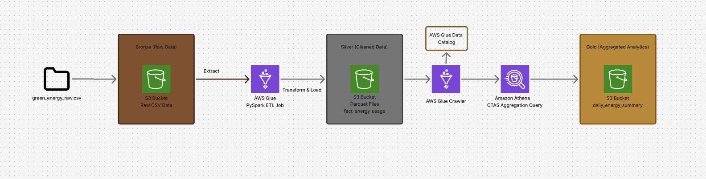

Overview
This project demonstrates a Data Lakehouse architecture built on AWS. It automates the ingestion, transformation, and optimization of raw green energy sensor data (CSV) into an analytical-ready format (Parquet) for business intelligence.

Architecture (Medallion Pattern)
The pipeline follows the Medallion Architecture to ensure data quality and lineage:
- Bronze (Raw): Ingests raw, "dirty" CSV sensor logs into Amazon S3.
- Silver (Cleansed): A PySpark (AWS Glue) job performs schema enforcement, handles null values, and converts data to Apache Parquet for performance.
- Gold (Curated): Aggregated business metrics (e.g., daily consumption per source) made queryable via Amazon Athena.

Tech Stack
Storage: Amazon S3 (Object Storage)
Compute: AWS Glue (Serverless PySpark)
Cataloging: AWS Glue Data Catalog & Crawlers
Analytics: Amazon Athena (Serverless SQL)
Languages: Python (PySpark), SQL

Key Features & Engineering Decisions
- Schema Enforcement: Transformed "String" based CSV inputs into proper Timestamp and Double types to ensure downstream calculation accuracy.
- Storage Optimization: Converted row-based CSVs to columnar Parquet with Snappy compression, reducing storage footprint and decreasing Athena query costs by roughly 80-90%.
- Data Quality: Implemented logic to normalize energy source categories (lowercase) and handle missing (null) consumption values.
- Scalability: Used AWS Glue's serverless workers (DPUs), allowing the pipeline to scale horizontally based on data volume.

Setup & Usage
S3 Setup: Create a bucket and folders for 01-bronze-raw, 02-silver-stage, and 03-gold-analytics.
IAM Configuration: Ensure your Glue Job Role has the AWSGlueServiceRole and AmazonS3FullAccess policies.
Job Parameters: In the Glue Job settings, add a parameter --BUCKET_NAME pointing to your unique S3 bucket.
Run ETL: Execute the Glue Job and verify the .parquet files appear in the Silver directory.
Analyze: Run the Glue Crawler and query the results in Amazon Athena using the provided SQL scripts.

Challenges Overcome
- IAM Cross-Service Permissions: Resolved 403 Access Denied errors by refining Trust Relationships between IAM Roles and Glue/S3 services.
- Regional Latency: Optimized S3 bucket endpoints to match the Glue execution region, preventing redirect/connection errors.

Architecture
